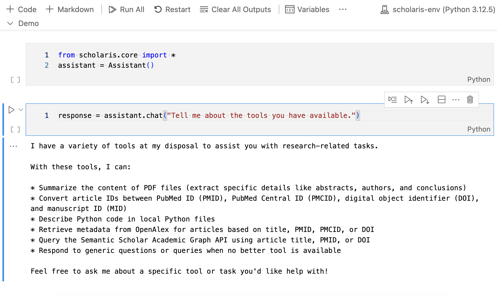

# User Interfaces


<!-- WARNING: THIS FILE WAS AUTOGENERATED! DO NOT EDIT! -->

## Working in a Jupyter notebook environment

<div class="border">

<figure>

<figcaption aria-hidden="true">Jupyter Notebook Interface</figcaption>
</figure>

</div>

``` python
from scholaris.core import *
```

``` python
assistant = Assistant()
```

    Loaded Semantic Scholar API key from the environment variables.
    Loaded email address from the environment variables.
    A local directory /Users/user2/GitHub/scholaris/data already exists for storing data files. No of files: 1

``` python
assistant.chat("Tell me about your tools")
```

    I can assist with a variety of tasks, including:

    * Extracting text from PDF files
    * Retrieving titles and first authors of research articles
    * Summarizing local documents (PDF, markdown, or text)
    * Describing Python code in local files
    * Converting IDs (PMIDs, PMCIDs, DOIs) using the id_converter_tool
    * Querying OpenAlex API for article metadata based on title, PMID, PMCID, or DOI
    * Querying Semantic Scholar Academic Graph API for article metadata based on title, PMID, or DOI

    Please let me know how I can assist you with any of these capabilities!

    'I can assist with a variety of tasks, including:\n\n* Extracting text from PDF files\n* Retrieving titles and first authors of research articles\n* Summarizing local documents (PDF, markdown, or text)\n* Describing Python code in local files\n* Converting IDs (PMIDs, PMCIDs, DOIs) using the id_converter_tool\n* Querying OpenAlex API for article metadata based on title, PMID, PMCID, or DOI\n* Querying Semantic Scholar Academic Graph API for article metadata based on title, PMID, or DOI\n\nPlease let me know how I can assist you with any of these capabilities!'

<div>

> **Tip**
>
> To list the files in the local data directory that has been created at
> initialization, simply use the Python built-in `os` module. Pass the
> assistant’s `data_dir` attribute as an argument to the `os.listdir()`
> function, like so:
>
> ``` python
> import os
> os.listdir(assistant.dir_path)
> ```
>
> You can alos use Python’s built-in functions to copy files from a
> designated source (e.g., Downloads) to the local data directory that
> was created at initialization. For example, to copy a file named
> `example.md` from the Downloads directory to the local data directory,
> use the following code:
>
> ``` python
> import shutil
> shutil.copy(os.path.expanduser('~/Downloads/example.md'), assistant.dir_path)
> ```
>
> Likewise, to remove a file from the local data directory, use the
> following code:
>
> ``` python
> os.remove(os.path.join(assistant.dir_path, 'example.md'))
> ```

</div>

## Use the assistant with Streamlit

<div class="border">

<figure>

<figcaption aria-hidden="true">Streamlit Interface</figcaption>
</figure>

</div>

To use the assistant with [**Streamlit**](https://streamlit.io/), you
need to install the [Streamlit
package](https://pypi.org/project/streamlit/).

<div>

> **Note**
>
> Remember to set up a virtual environment for your project before
> installing Streamlit. This will help you avoid conflicts with other
> packages that you may have installed in your base environment.

</div>

You can install Streamlit using pip:

``` sh
pip install streamlit
```

Then, download the `ui.py` file from the `scholaris` directory in the
Scholaris repository. Run the following command in the terminal to
download the file to your current working directory:

``` sh
wget https://raw.githubusercontent.com/nicomarr/scholaris/main/ui.py
```

If wget is not installed on your local computer, you may also use curl,
like so:

``` sh
curl -O https://raw.githubusercontent.com/nicomarr/scholaris/main/ui.py
```

To run the streamlit app, activate the virtual environment. Then, go to
the directory where the `ui.py` file is located and run the following
command in the terminal:

``` sh
streamlit run ui.py
```

This will start the local server and the app will be accessible in your
local network via a web browser. Alternatively, you can run the command
in the terminal with an additional flag so that the app will only be
accessible from your local computer:

``` sh
streamlit run ui.py --browser.serverAddress localhost
```

<div>

> **Note**
>
> If you don’t want to download the `ui.py` file from Github, you can
> also copy the code block from below and paste it into a new Python
> file in your working directory. Then run it using the command
> `streamlit run <filename>.py`.
>
> <details class="code-fold">
> <summary>Code</summary>
>
> ``` python
> from scholaris.core import *
> import streamlit as st
> import ollama
> from datetime import datetime
> import json
> import os
> from pathlib import Path
>
> def download_conversation_history():
>     now = datetime.now().strftime("%Y-%m-%d_%Hh%Mm%Ss")
>     conversation_history = st.session_state.assistant.messages
>     filename = f"conversation_history_{now}.json"
>     return json.dumps(conversation_history, indent=2), filename
>
> def show_local_data(dir_path: Path) -> None:
>     try:
>         for file in dir_path.iterdir():
>             st.write(f"{file.name}")
>     except Exception as e:
>         st.write(f"Error: {e}")
>     
> def handle_file_uploads(uploaded_files):
>     dir_path = st.session_state.assistant.dir_path
>     if not dir_path.exists():
>         return
>
>     for uploaded_file in uploaded_files:
>         file_path = st.session_state.assistant.dir_path / uploaded_file.name
>         if file_path.exists():
>             continue
>         try:
>             with open(file_path, "wb") as f:
>                 f.write(uploaded_file.getbuffer())
>             if "uploaded_files" not in st.session_state:
>                 st.session_state["uploaded_files"] = []
>             st.session_state["uploaded_files"].append(file_path)
>         except Exception as e:
>             error_placeholder = st.empty()
>             error_placeholder.error(f"Error saving {uploaded_file.name}: {str(e)}")
>             time.sleep(1)  # Display error for 1 second
>             error_placeholder.empty()
>     uploaded_files = []
>     
> def delete_uploaded_files():
>     if "uploaded_files" in st.session_state and st.session_state["uploaded_files"] != []:
>         file_count = 0
>         for file_path in st.session_state["uploaded_files"]:
>             try:
>                 os.remove(file_path)
>                 file_count += 1
>             except Exception as e:
>                 error_placeholder = st.empty()
>                 error_placeholder.error(f"Error deleting {file_path}: {str(e)}")
>                 time.sleep(1)  # Display error for 1 seconds
>                 error_placeholder.empty()
>         st.write(f"{file_count} file(s) deleted.")
>         st.session_state.uploaded_files = []
>
> def get_last_tool_names(messages):
>     """Returns the tool names from the most recent tool call in the messages."""
>     tool_names = []
>     for message in reversed(messages):
>         if message["role"] == "assistant" and "tool_calls" in message:
>             for fn in message["tool_calls"]:
>                 name = fn["function"].get("name")
>                 if name:
>                     tool_names.append(name)
>             break # Exit the loop after the first occurrence
>     return ", ".join(tool_names) if tool_names else "No tools used."
>
> # Page configuration
> st.set_page_config(
>         page_title="Scholaris", 
>         page_icon=":speech_balloon:",
>         layout="wide", 
>         initial_sidebar_state="collapsed", 
>         menu_items={
>             "About": "This is a graphical user interface for Scholaris, a conversational AI assistant for academic research.",
>             "Get Help": "https://github.com/nicomarr/scholaris/blob/main/nbs/02_ui.ipynb",
>             "Report a Bug": "https://github.com/nicomarr/scholaris/issues/new"
>         }
>         )
>
> # Initialize the assistant if not already in session state
> if "assistant" not in st.session_state:
>     try:
>         st.session_state.assistant = Assistant(model="llama3.1", dir_path="./data")
>     except Exception as e:
>         if "[Errno 61] Connection refused" in str(e):
>             st.error(f"""An error occurred: {e}. Please make sure Ollama is installed on your local computer and the server is running.
>             For troubleshooting, refer to the Ollama docs of GitHub:
>             [README](https://github.com/ollama/ollama/blob/main/docs/README.md)
>             [FAQ](https://github.com/ollama/ollama/blob/main/docs/faq.md).
>             """)
>         else:
>             st.error(f"An error occurred: {e}")
>         st.stop()
>
> # Initialize other session state variables
> if "uploaded_files" not in st.session_state:
>     st.session_state.uploaded_files = []
>
> # Start conversation
> if len(st.session_state.assistant.messages) < 2: # <2 because the assistant is initialized with a system message
>     st.session_state.assistant.messages.append({"role": "assistant", "content": "How can I help you?"})
>
> if st.session_state.assistant:
>     with st.sidebar:
>         # Set up the sidebar
>         st.title("Scholaris")
>         st.caption(str(st.session_state.assistant))
>         # Conversation History Section
>         st.write("---")
>         st.subheader("Conversation History") 
>         st.download_button(label="Download", 
>             help="Download the conversation history as a JSON file.",
>             data=download_conversation_history()[0],
>             file_name=download_conversation_history()[1],
>             mime="text")
>
>         if st.button(label="Reset", type="primary", 
>             help="Click to restart the conversation.", 
>             key="reset_messages"):
>                 st.session_state.assistant.clear_conversation_history()
>                 st.session_state.assistant.messages.append({"role": "assistant", "content": "How can I help you?"})
>                 st.write("Conversation history cleared!")
>             # st.rerun()  # Rerun the script to update the chat interface and the sidebar
>
>         # Local Data Section
>         st.write("---")
>         st.subheader("Local Data")
>         dir_path = st.session_state.assistant.dir_path
>         with st.expander("Data files"): 
>             show_local_data(dir_path)
>
>         # File Upload Section
>         uploaded_files = st.file_uploader(
>             label="Upload files",
>             type=['pdf','txt','md','markdown','py'],
>             accept_multiple_files=True,
>             )
>         if uploaded_files:
>             handle_file_uploads(uploaded_files)
>
>         # Delete Uploaded Files Section
>         if st.session_state.uploaded_files:
>             if st.button(
>                 label="Delete uploaded files", 
>                 type="primary",
>                 help="Only uploaded files will be deleted. Already existing files will not be deleted.", 
>                 key="delete_data_files"
>             ):
>                 delete_uploaded_files()
>
>         st.write("---")
>         st.write("Source code available on [GitHub](https://github.com/nicomarr/scholaris/blob/main/scholaris/ui.py)")
>
>
>     # Main Chat Interface
>     for msg in st.session_state.assistant.messages: # Display chat messages from history on app rerun
>         if msg["role"] == "system" or msg["role"] == "tool": # Skip system message and tool returns
>             continue
>         elif msg["role"] == "assistant" and "content" not in msg: # Skip tool calls where no content is returned
>             continue
>         with st.chat_message(msg["role"]):
>             st.markdown(msg["content"])
>     
>     if prompt := st.chat_input(): # Await user input
>         with st.chat_message("user"): # Display user message in chat message container
>             st.markdown(prompt)
>         with st.spinner("Thinking...") as status: # Display status while assistant is processing
>             with st.chat_message("assistant"):
>                 stream = st.session_state.assistant.chat(prompt=prompt, redirect_output=True)
>                 try:
>                     if stream:
>                         response = st.write_stream(stream)
>                     else:
>                         st.markdown("I'm sorry, I am unable to respond to that query.")
>                 except Exception as e:
>                     st.error(f"An error occurred: {e}")
>         with st.popover("Tools used"):
>             st.markdown(get_last_tool_names(st.session_state.assistant.messages))
> ```
>
> </details>

</div>
